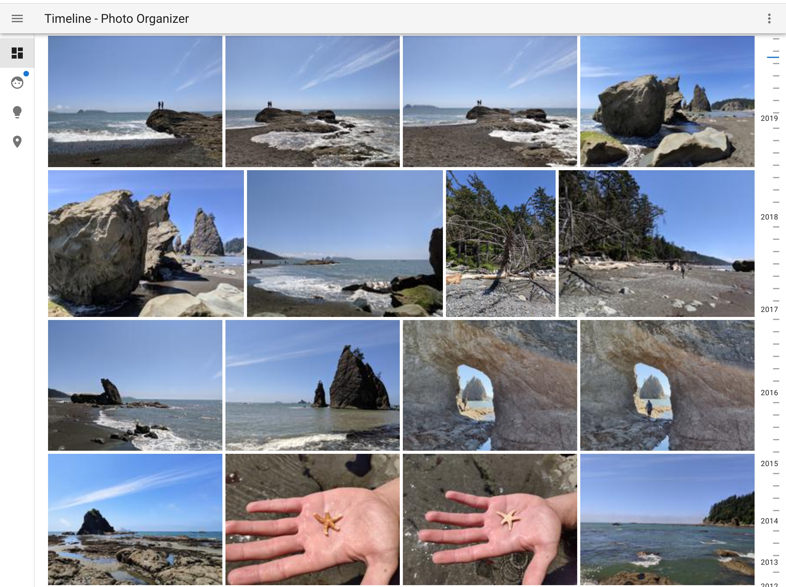
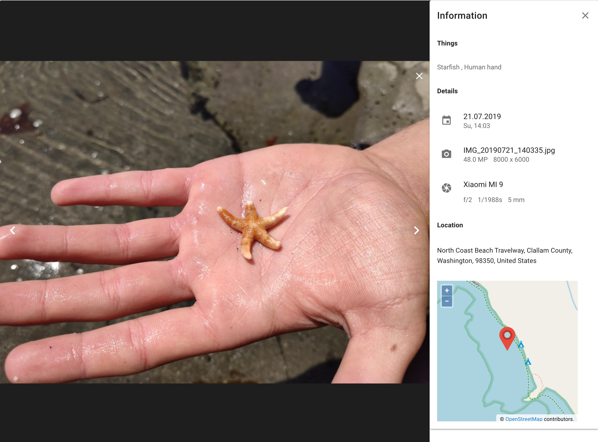
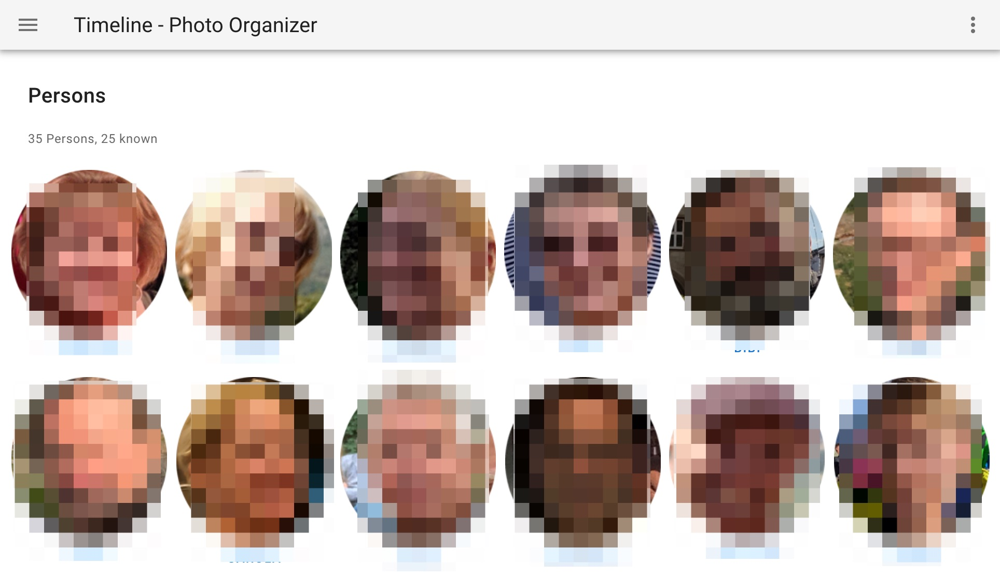
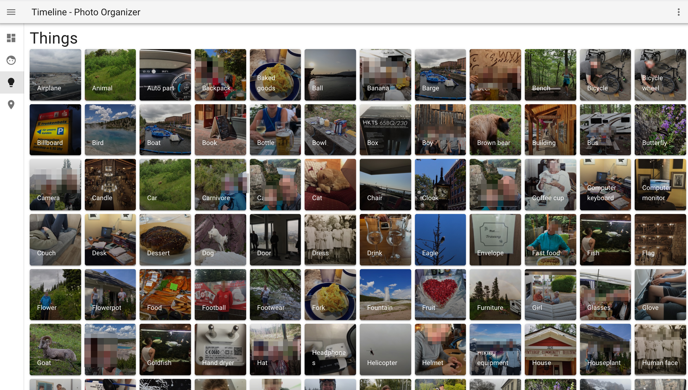
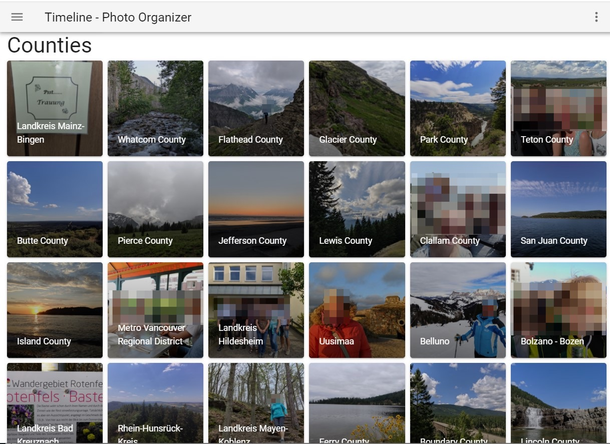
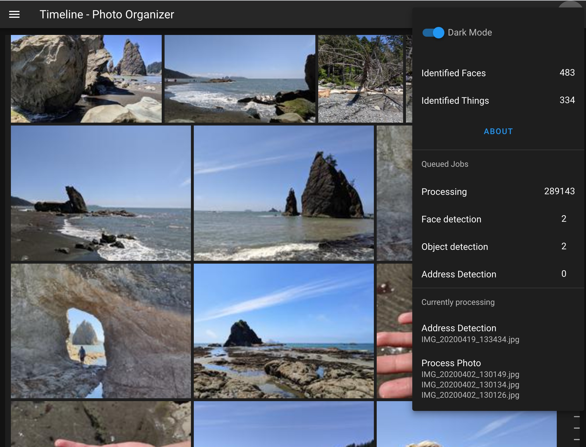
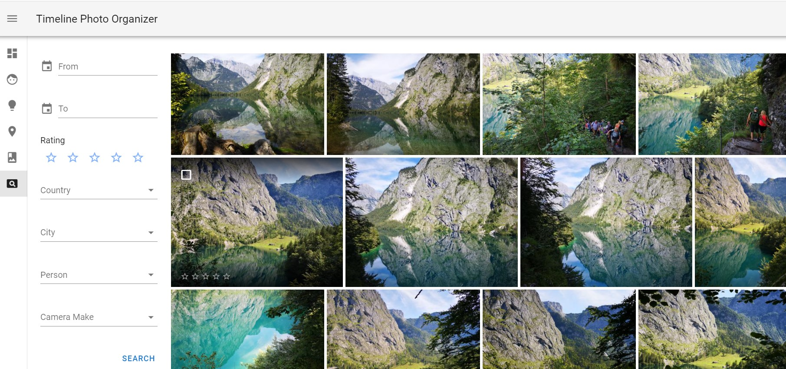
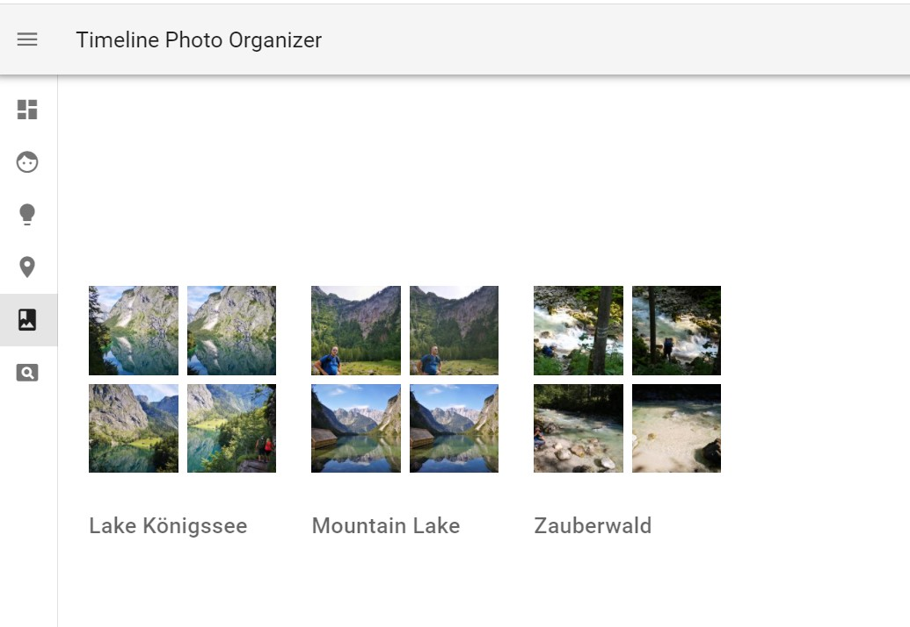

# Timeline - Photo Organizer
Timeline is a web application which aims to organize photos similar to how 
Google Photos or Amazon Photos does. Instead of Google or Amazon Photos it is not running in the cloud
but on you own Device (Server, NAS, PC)
## Features
* Timeline reads and monitors photos from a specified directory on your device. It doesn't touch any of your photos, all data is written elsewhere. 
When using docker the photo path is mounted read-only. If this it running on a Synology or QNAP Device the preview generated by DSM or QTS are ignored.
* It will display photos in a timeline based view, ordered by date (newest photos first) with fast endless scrolling functionality (no paging)
* Timeline extracts exif data. A limited set is visible in the information panel 
* It will detect faces on the photos using MTCNN (Tensorflow)
* Once some faces are detected, they can be named. Other faces are matched against the known faces
* In order to ease up the face classification it clusters similar faces for easy naming
* It tries also to do some object detection in the photos using Tensorflow; currently using 
* If GPS information is present in the Exif Data it will do a reverse geo location look to resolve the address
* When viewing an Photo in full screen you will see of of the detected information (Identified and non identified faces, things 
a resolved address along with a little map and some important Exif data)

### New (0.7)
* Selection of Photos via left and right cursor keys
* Rating of Photos via the usual Rating stars either by clicking the rating while hovering over a photo or selecting a photo via cursor left/right and use the 0-5 keys (filtering for the so rated photos will follow)
* Option to change the preview size to accommodate more or less on the photo wall

### New (0.8)
* Selection of Multiple Photos at one by Shift-Click
* Albums can be created (and deleted)
* New Albums Overview 
* Photos can be removed from the Catalog
* New Search View. Photos can be searched by Date Range, Rating, Camera Make, Country, City, People
* A new default Album "Last Import" is created and filled by last added photos accessible with a new navigation shortcut 
* A new simple view showing the photos to be sorted into the index is available

## New 0.85
* Major re-arrangement with regards to workers. Now only one worker process is required - should be fast but due to loading the models now in each preforked worker process they consume more memory. On something with only 4GB RAM the number of worker should only be 1. With 8GB 3-4 should be ok. Due to using preforked workers they will now be scaled down when not needed anymore. 
* Searching for Photos by date, rating, location can now be saved as "smart album" (not really smart but I didn't find a better name). Once defined they also can be edited afterwards.
* For faces it is now detect the expression (happy, sad, neutral ...). This will be later used to find some nice photos of happy people. I was also trying this with gender and age but it was not very precise

## Next to come
* Upload of photos
* Bug fixing
* 

### General View

### Fullscreen Photo with information panel

Please note that it detects more than just one thing.

## Faces and Persons

## Things and Objects

## Places

## Info

There is also a Dark Mode and an information panel showing what is happening in the background.

## Search View

There is also a new Seach View (to be extended) to query photos by various combined attributes

## Album View

Photos can be selected and added to existing or new Albums

# How to use it
The easiest way is to use Docker, resp. docker-compose 
1. `wget https://raw.githubusercontent.com/hulk66/timeline/main/docker-compose.yml` 
2. `wget https://raw.githubusercontent.com/hulk66/timeline/main/env`, modify the env file according to your needs and save it as `.env`. The following things have to be changed:
   1. `PHOTO_PATH` - this points to the directory where you photos are located. Timeline will recursively scan all Photos (at the moment only JPG). This is read-only: Timeline will not change anything in here.
   2. `PREVIEW_PATH`- For performance reasons this directory is used to generate all kinds of previews.
   3. `LOG_PATH`- This is where Timeline does the logging. Most important here is the `worker.log`.
   4. `DATABASE_DATA` - Here is where all data from mariaDB is saved
   5. `RABBITMQ_DATA`- Same for RabbitMQ which is used as the message broker
   6. `THREADS`- Number of threads to be used. This depends on the machine you are running Timeline on. In general the number of physical processors is a good start
   7. `DB_SUPER_USER_PW` - is the password for to access the database (via adminer)

   If used with Docker please specify all paths absolute   

   Important: **All directories have to exist**. They won't be created. 

Once you have the `.env` file in place run it with 
`docker-compose up` or `docker-compose up -d` to run it in the background. 

Given everything is downloaded from Dockerhub (mariaDB, RabbitMQ ...) it may take 3-4 minutes to start up all containers depending on the system.

If all containers are up and running you should be able to see some change in the `worker.log` in the specified `LOG_PATH`.

* To access Timeline go to `http://<whereever_it_runs>:9090`. 
* In case you are interested in some internals you can also go to `http://<whereever_it_runs>:9091` to reach adminer and have a look into the underlying database. The user is "root" and the password is the one you have specified in the `.env` (example)
* There is also running the user interface for RabbitMQ under `http://<whereever_it_runs>:15672`. Username and Password is per default guest/guest

When running for the first time give it some time to start and process initially some photos. Timeline is doing a "sectioning" of photos. Photos are sorted chronological in sections. A section is a set of photos (300-500) that are chronological next to each other. This section information is then used on the frontend side in order order to load the related photos. More importantly a section of photos is also unloaded if not visible anymore. Otherwise the browser is getting slower once it comes close to 1000 photos to be displayed.

The sectioning is configured to happen every 15 minutes.

There are two other background tasks:

* Once the user starts to name Faces, Timeline will try to match similar faces which have not been identified yet. This will happen every 30 minutes.
* Every 45 minutes Timeline will try to do face clustering for unidentified faces. Similar faces are grouped together for easy naming in the People view. If there is a new cluster, it will be indicated with a small blue badge on the People Icon.

## Hardware disclaimer

Timeline was tested in Docker instance with limited resources: 4GB of RAM and 2 Cores might work. Don't try it with less.

As always: the more the better but 8GB RAM and 4 Cores is recommended.

## Performance 

While the user interface should be reasonable fast the AI based face and thing recognition are really slow. User patience is required. On a decent NAS with a AMD RX-421ND (Quad-Core 2,1 GHz) processor and enough RAM (16GB) Timeline processes approx. 500 Photos per hour including face, thing recognition and GPS reverse lookup. For the geo lookup OpenStreepMap is used. In order not get a "Too Many Requests" error the the request rate is limited to 1 request per second. A fast laptop (Intel i7, 6 Cores, 32GB) will process around 2000 photos per hour.

## Used Products and Tools

Timeline is heavily using a number of great other tools and frameworks. Just to list the most prominent ones:

Backend
* Python 3.8 as implementation language
* Flask as framework for REST services for the frontend
* SQLAlchemy for doing the object relational mapping
* When using Docker: mariaDB as the underlying relational database
* Celery as task queueing system for handling all asynchronous photo tasks 
* When using Docker: RabbitMQ as message broker used by Celery
* Tensorflow for doing object and thing detection and also for doing all face recognition tasks. The models used for this are MTCNN and VGGFace
* GeoPy for doing the reverse geo location lookup, using OpenStreetMap

Frontend

* VueJS as the elementary frontend framework
* Vuetify for providing all the nice material components
* nginx as the webserver acting as the proxy for the webapp and for efficiently delivering the generated previews

# Known issues

* During the the processing it may happen the the database provide a Timeout error due to a locked resource. This actually should not be a problem as the so failed task is repeated at a later point in time by Celery

# Improvements/Outlook

Where should I start?

* Remove bugs
* Improve AI tasks (faces and things) performance: not sure I will have the capacity and/or knowledge for this
* Improve user interface, especially implement search capabilities for People, Things and places
* Improve frontend performance by generating previews for Places and Things view
* Implement (Smart) Albums: done
* Implement Ratings. For both point the database model is already prepared: Done
* This is nearly test-free code (which is very bad). Needs to be improved
* Multi Language support. Nothing done here at the moment.
* Ability to upload new photos
* Ability to read also RAW photos

# License
Copyright © 2020-2021 by Tobias Himstedt. All rights reserved.

See also <a href="https://www.gnu.org/licenses/gpl.txt">GNU General Public License version 3</a>

# Finally ...

Please note: this project is a one-man-show for now and I'm doing this next to my work. Don't expect something professional.

